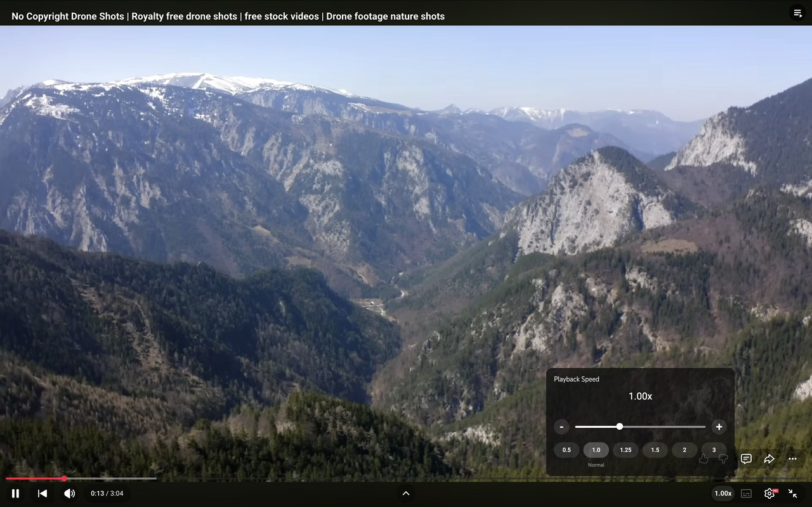
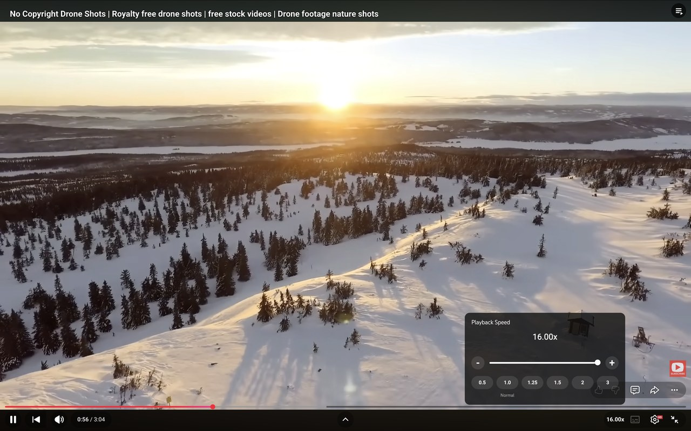
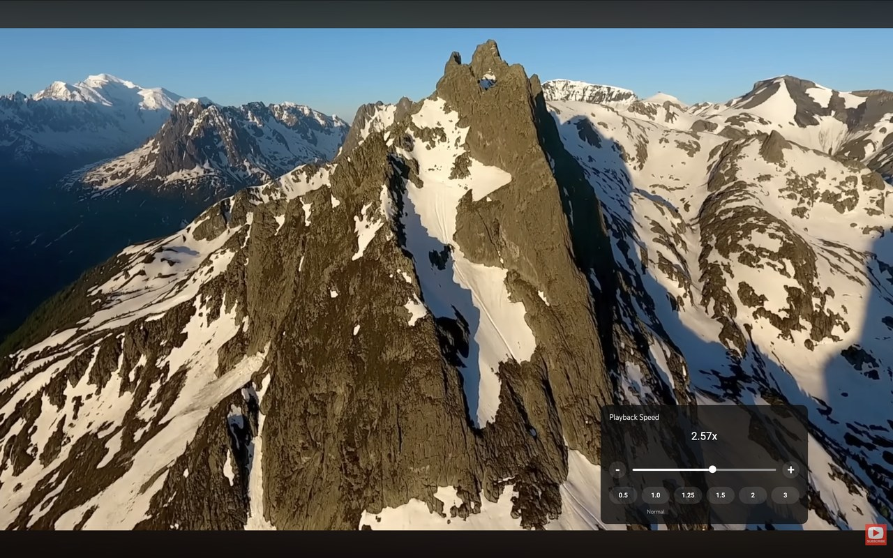
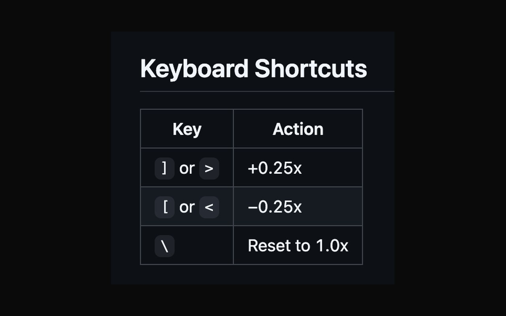

# YT Playback Speed Controller

A Chrome extension that adds a fine-grained playback speed controller directly into YouTube's player bar — no settings menus, no page reloads.

---

## Features

- **Trigger button** in the player control bar showing the current speed (e.g. `1.00x`)
- **Speed panel** styled to match YouTube's native UI, with:
  - Large speed display updated in real time
  - Logarithmic slider from **0.25x to 16x** — precise at normal speeds, full range for power users
  - − / + buttons for ±0.05x fine-tuning
  - Preset chips: `0.5`, `1.0` (Normal), `1.25`, `1.5`, `2.0`, `3.0`
- **Keyboard shortcuts** work anywhere on the page:
  - `]` or `>` — speed up 0.25x
  - `[` or `<` — slow down 0.25x
  - `\` — reset to 1.0x
- Stays in sync with YouTube's own speed menu (`ratechange` event)
- Survives YouTube's SPA navigation (re-injects on every page transition)

---

## Screenshots

| Default (1.00x) | Full speed (16.00x) |
|---|---|
|  |  |

| Custom speed (2.57x) | Keyboard shortcuts |
|---|---|
|  |  |

---

## Installation (Development)

1. Clone or download this repository
2. Open Chrome and go to `chrome://extensions`
3. Enable **Developer mode** (toggle in the top-right)
4. Click **Load unpacked** and select the project folder
5. Open any YouTube video — the speed button appears in the player controls

To reload after making changes: click the refresh icon on the extension card in `chrome://extensions`, then refresh the YouTube tab.

---

## File Structure

```
yt-speed-controller/
├── manifest.json        # MV3 extension manifest
├── content.js           # Single IIFE — injects UI, handles speed logic & keyboard shortcuts
├── style.css            # Minimal overrides; YouTube's own stylesheet handles most styling
├── LICENSE              # MIT license
├── generate_icons.py    # Script to regenerate PNG icons (pure Python stdlib, no deps)
└── icons/
    ├── icon16.png
    ├── icon48.png
    └── icon128.png
```

---

## Regenerating Icons

The icons are generated by `generate_icons.py` using only Python's built-in `struct` and `zlib` modules — no external dependencies needed.

```bash
python3 generate_icons.py
```

This overwrites `icons/icon16.png`, `icons/icon48.png`, and `icons/icon128.png` with a dark rounded square (`#0F0F0F`) and a red play triangle (`#FF2020`). Edit the color constants at the top of the script to customize the design, then re-run.

---

## How It Works

**Trigger button** — a `button.ytp-button` inserted as the first child of `.ytp-right-controls`. A `span.ytsp-badge` inside shows the active speed.

**Speed panel** — appended to `document.body` with `position: fixed` and viewport-relative coordinates so YouTube's player overflow can never clip it. The inner DOM mirrors YouTube's own `ytp-variable-speed-panel-content` structure so YouTube's global stylesheet styles the menu rows, fonts, and colors natively.

**Logarithmic slider** — the `<input type="range">` runs from `0` to `1000` internally. Two conversion functions map between slider position and speed on a log scale, giving 4x better precision in the 0.25–2x range compared to a linear 0–16 slider.

**SPA navigation** — `yt-navigate-finish` fires on every YouTube page transition. The extension tears down and re-injects the widget with a short delay to wait for the player to mount.

---

## Keyboard Shortcuts

| Key | Action |
|-----|--------|
| `]` or `>` | +0.25x |
| `[` or `<` | −0.25x |
| `\` | Reset to 1.0x |

Shortcuts are suppressed when focus is in an `<input>`, `<textarea>`, or `contenteditable` element.

---

## Chrome Web Store

> Coming soon.

---

## License

[MIT](LICENSE) © 2026 Shikhar Singh
